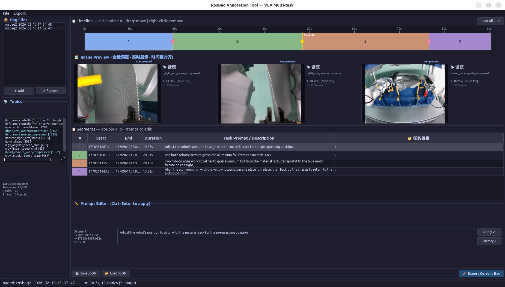

# RosBag Annotator

ROS2 数据包可视化切分与标注工具，面向 VLA（Vision-Language-Action）多任务训练数据准备。



---

## 一键部署

## 快速开始

### 环境要求

- Python 3.10+
- （可选）ROS 2（Humble / Iron / Jazzy）

### 一键安装

```bash
git clone <repo>
cd rosbag_annotator
bash install.sh
```

安装完成后运行：

```bash
bash run.sh
```

### 带 ROS 2 支持运行

```bash
source /opt/ros/<distro>/setup.bash
bash run.sh
```

> 不 source ROS 也可运行，图像解码使用内置 CDR 解析器，导出使用 `ros2 bag filter` CLI。

### 手动安装

```bash
# conda 环境
conda create --name rosAnnotator
conda activate rosAnnotator
pip install PyQt6 pyyaml numpy opencv-python
pip install -e .
python main.py

# python 环境
python3 -m venv .venv
source .venv/bin/activate
pip install PyQt6 pyyaml numpy opencv-python
pip install -e .
python main.py
```


## 功能概览

- **时间轴交互**：点击添加切割点，拖拽移动，右键删除
- **多路图像实时预览**：所有图像话题并列展示，光标移动同步显示对应帧
- **Prompt 标注**：每段独立设置任务描述，支持历史记录快速复用
- **子 Bag 导出**：切割结果写入独立子 Bag，重复导出自动覆盖
- **JSON 持久化**：标注结果保存/加载，支持跨会话继续工作

---

## 目录结构

```
rosbag_annotator/
├── main.py                       # 程序入口
├── install.sh                    # 一键安装脚本
├── pyproject.toml                # 包配置
├── README.md
└── rosbag_annotator/             # 核心包
    ├── __init__.py
    ├── models.py                 # 数据模型
    ├── meta.py                   # Bag 元数据解析
    ├── cdr.py                    # CDR 图像解码
    ├── extractor.py              # 帧提取线程
    ├── preview.py                # 图像预览控件
    ├── timeline.py               # 时间轴控件
    ├── table.py                  # 分段表格
    ├── prompt_panel.py           # Prompt 编辑器
    ├── export.py                 # 导出线程
    ├── dialogs.py                # 通用对话框
    └── main_window.py            # 主窗口
```

---

## 模块说明

### `models.py` — 数据模型

| 类 | 职责 |
|----|------|
| `Segment` | 单个切割段（起止时间、Prompt、输出目录） |
| `BagMeta` | Bag 元信息（话题列表、时长、消息数） |
| `BagAnnotation` | 一个 Bag 的完整标注（切割点 + Prompt 列表） |

---

### `meta.py` — 元数据加载

读取 `metadata.yaml`，处理 uint32 时间戳回绕，返回 `BagMeta`。

---

### `cdr.py` — CDR 图像解码

```
raw bytes → QImage（线程安全）

解码优先级：
  rclpy 官方反序列化（最准确）
    ↓ 不可用时
  手写 CDR 解析器（fallback）

支持编码：mono8 / rgb8 / bgr8 / bgra8 / rgba8 / mono16 / CompressedImage
```

> **注意**：`QPixmap` 必须在主线程创建，`cdr.py` 只返回 `QImage`，转换在 `add_frame()` 中完成。

---

### `extractor.py` — 帧提取线程（`FullFrameExtractor`）

解决 rosbag2_py 多文件乱序问题的核心模块：

```
.db3 文件列表（按文件名排序）
  ↓ ORDER BY rowid（录制顺序，非时间戳排序）
单调展开（monotonic unwrapping）处理 32 位计数器回绕
  ↓ ~4.295s 回绕一次，展开后时间戳严格单调递增
时间系统对齐（Unix epoch vs ROS monotonic）
  ↓ 差值超过 bag 时长 × 10 时自动平移
优先使用 CDR header.stamp（绝对时间，跨话题对齐）
  ↓ 无效时回退计数器展开值
emit frame_ready(ts_ns, QImage)
```

非 SQLite 格式（MCAP 等）回退至 `rosbag2_py.SequentialReader`。

---

### `preview.py` — 图像预览控件

| 类 | 职责 |
|----|------|
| `SingleStreamPanel` | 单话题帧序列显示，O(log n) bisect 查找 |
| `MultiStreamPreviewWidget` | 管理 N 个 Panel，共享时间轴同步更新 |

**显示流程**：
```
cursor_moved(ns)
  → show_at(ns) [每次鼠标移动，无 debounce]
  → bisect_right(_ts_arr, ns) - 1
  → setPixmap（直接调用，无线程）
```

**限流**：帧批量到达时启动 33ms 定时器（~30fps），避免高频 `setPixmap` 闪烁。

---

### `timeline.py` — 时间轴控件（`TimelineWidget`）

| 交互 | 行为 |
|------|------|
| 左键点击轨道 | 添加切割点 |
| 拖拽菱形 handle | 移动切割点（邻近约束） |
| 右键菱形 handle | 删除切割点 |
| 点击色块 | 选中分段 |
| 鼠标悬停 | 发射 `cursor_moved(ns)` |

信号：`cut_points_changed` / `segment_selected` / `cursor_moved`

---

### `table.py` — 分段表格（`SegmentTable`）

列：`#` / `Start` / `End` / `Duration` / `Prompt` / `输出目录`

| 操作 | 触发方式 |
|------|---------|
| 编辑 Prompt | 双击 Prompt 列 |
| 设置输出目录 | 双击目录列 / 右键菜单 |
| 删除分段 | Delete 键 / 右键菜单 |

---

### `prompt_panel.py` — Prompt 编辑器（`PromptPanel`）

- `Ctrl+Enter` 快速提交
- History 按钮：从历史记录选择并直接应用
- 提交后自动同步到 `BagAnnotation` 和表格

---

### `export.py` — 导出线程（`ExportWorker`）

```
对每个分段：
  1. 计算输出路径 task_dir/{stem}_{idx+1:03d}
  2. 若目录已存在 → shutil.rmtree()（覆盖语义）
  3. 导出子 Bag：
       rosbag2_py API（首选）
       ros2 bag filter CLI（fallback）
  4. 追加 metadata.yaml custom_data：
       lerobot.operator_prompt: "<prompt>"
```

---

### `dialogs.py` — 通用对话框

| 函数 | 用途 |
|------|------|
| `qmsg()` | 信息 / 警告 / 错误 / 确认对话框 |
| `qinput_text()` | 大尺寸文本输入对话框，居中于主窗口 |
| `qinput_item()` | 历史选择列表对话框，支持双击确认 |

---

### `main_window.py` — 主窗口（`MainWindow`）

布局：

```
┌─ 左侧（255px 固定）──────┐ ┌─ 右侧（弹性）──────────────────────────┐
│ 📦 Bag 文件列表          │ │ ⏱ Timeline                              │
│ 📡 话题列表              │ │ 🖼 Image Preview（多路并列）             │
│ ℹ️  Bag 信息             │ │ 📋 Segments 表格                        │
│                          │ │ ✏️  Prompt Editor                       │
│                          │ │ [Save JSON] [Load JSON] [Export]        │
└──────────────────────────┘ └─────────────────────────────────────────┘
```

---

## 工作流程

```
1. ＋ Add  →  选择 bag 目录
2. 在时间轴点击  →  添加切割点（可拖拽调整）
3. 在表格双击 Prompt 列  →  填写任务描述
4. 在表格右键目录列  →  设置每段输出目录
5. 💾 Save JSON  →  保存标注（可随时继续）
6. 🚀 Export  →  导出子 Bag
```

---

## 依赖一览

| 包 | 必须 | 用途 |
|----|------|------|
| PyQt6 | ✅ | GUI |
| pyyaml | ✅ | 解析 metadata.yaml |
| numpy | ✅ | 图像数组操作 |
| opencv-python | ✅ | 图像解码与缩放 |
| rosbag2_py | 可选 | 读写 Bag（无则用 CLI） |
| rclpy | 可选 | CDR 反序列化（无则用内置解析器） |
